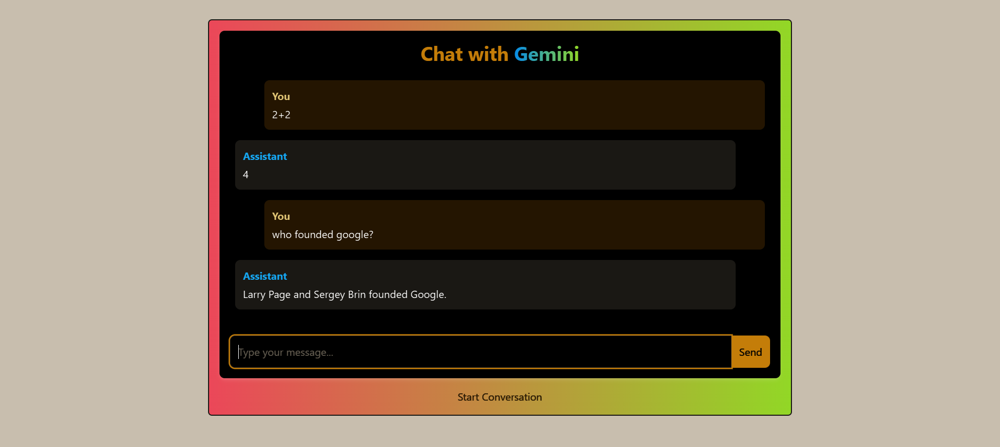

# AI Chat App with Gemini Integration

A modern, reactive chat application that uses Google's Gemini AI API to provide intelligent responses. The app features a clean UI built with React and Tailwind CSS, with a FastAPI backend that integrates with the Gemini API and includes tool functionality for reading files.

## Features

- Real-time chat interface with AI responses powered by Google's Gemini model  
- Tool calling functionality to read local files when requested  
- Modern UI with Tailwind CSS styling  
- Responsive design that works on desktop and mobile  
- FastAPI backend for efficient handling of requests  

## Tech Stack

- **Frontend**: React.js, Vite, Tailwind CSS  
- **Backend**: Python, FastAPI  
- **AI Integration**: Google Gemini API  

## Setup Instructions

Detailed setup instructions for both frontend and backend can be found in the project documentation.

## Screenshots

## License

MIT
